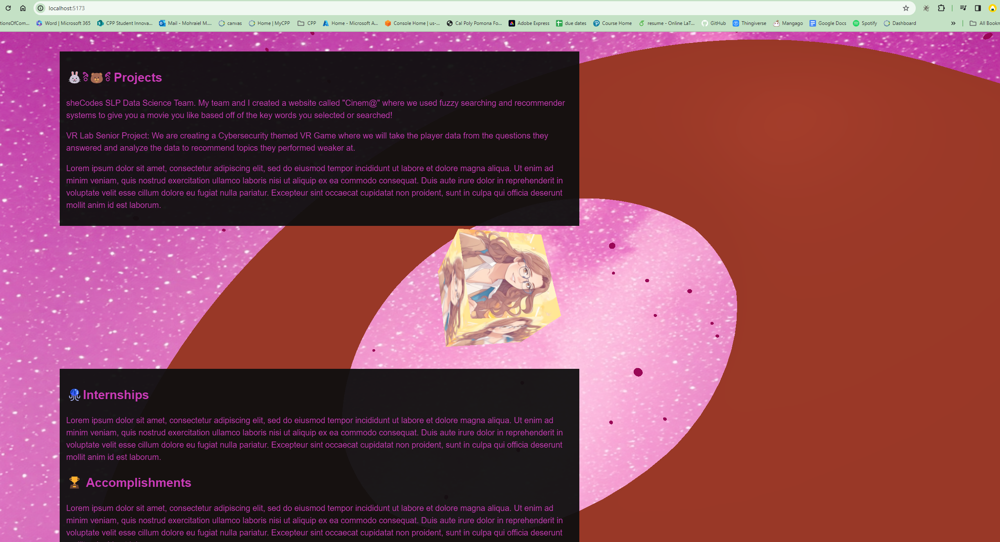

# Three.js Workshop: Portfolio Tutorial

Welcome to the Three.js Workshop! 🌐

## Overview

This repository is a documented tutorial on creating a portfolio using Three.js—a powerful JavaScript library for 3D graphics. Showcase your CS projects in an interactive and visually stunning way.

## Thank You!

Provided to you by sheCodes' Webmaster 💓

